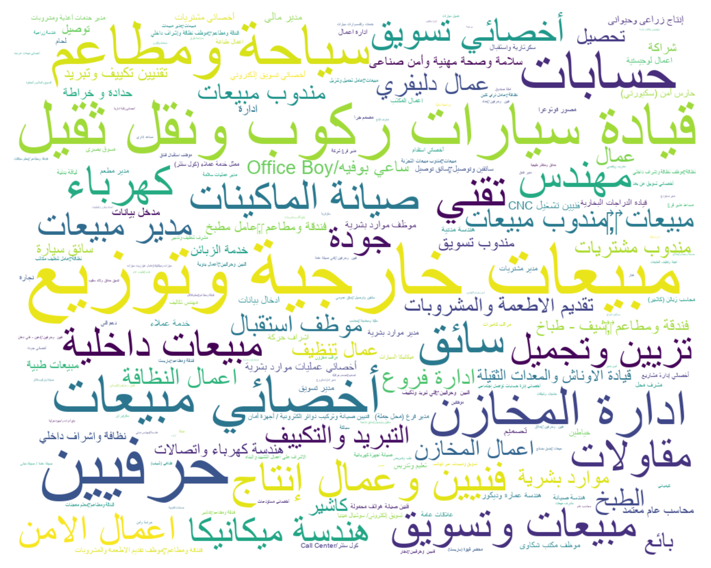
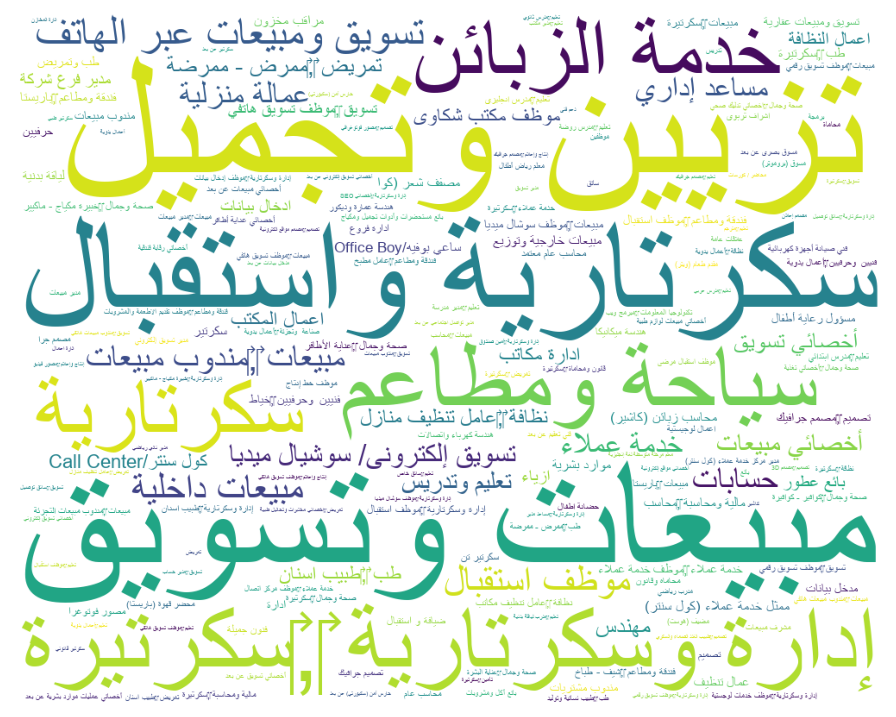
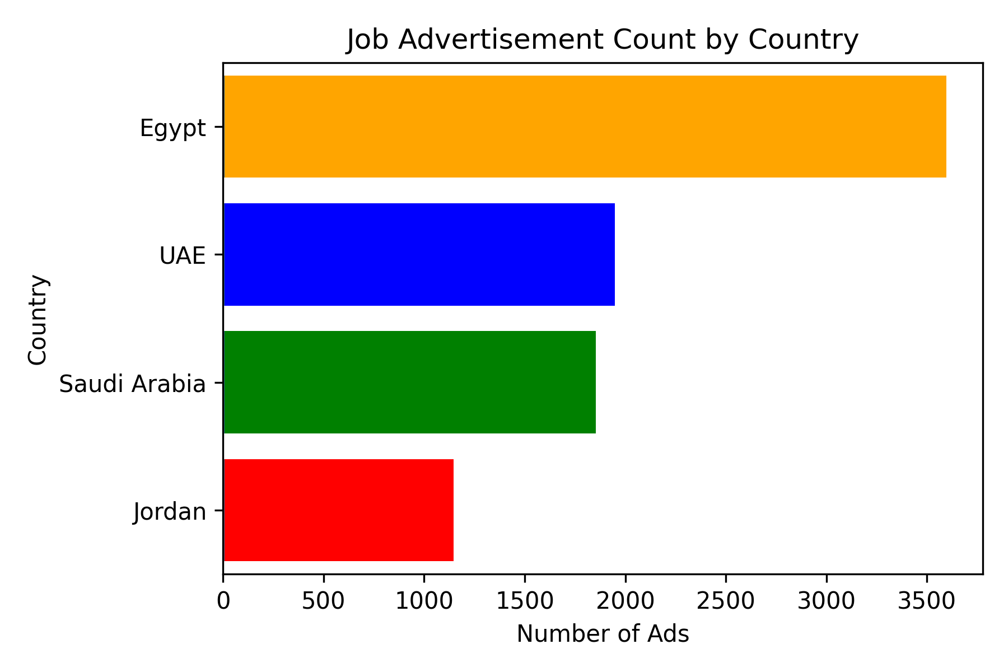
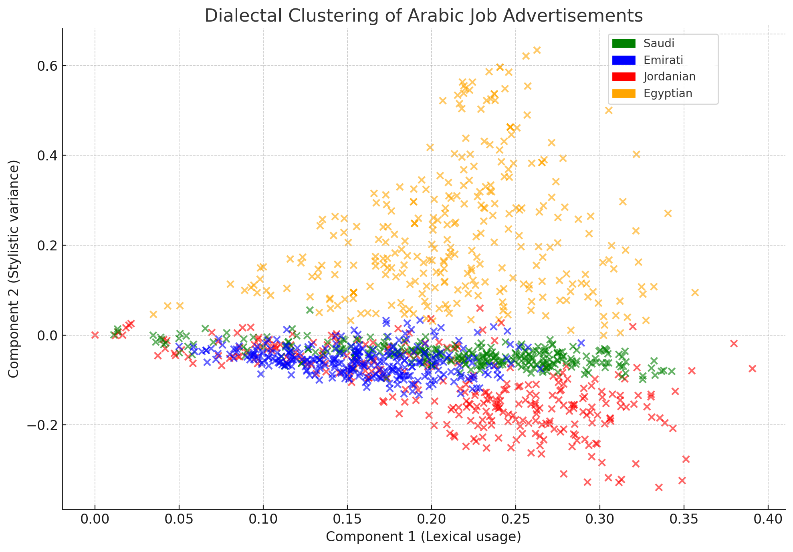

<!-- 
README for ArabJobs
Annotated with comments to explain each section.
These comments will not appear when rendered on GitHub.
-->

# ArabJobs: A Multinational Corpus of Arabic Job Ads  
<!-- Main project title -->

[](https://arxiv.org/pdf/2509.22589)  
[](#license)  
<!-- Example badges: link to paper, show licence -->

---

## 📖 About  
<!-- High-level summary of the dataset -->

**ArabJobs** is the first publicly available, multinational corpus of **Arabic job advertisements**.  
It was collected from **Egypt, Jordan, Saudi Arabia, and the UAE**, totalling:  

- **8,546 job postings**  
- **550,000+ words**  
- Coverage across multiple **sectors, dialects, and labour market contexts**  

This dataset enables research in:  
- Fairness-aware **Arabic NLP**  
- **Gender representation** and bias in recruitment language  
- **Dialectal variation** and code-switching  
- **Salary estimation** and **job category classification**  

---

## 📑 Reference  
<!-- Citation and BibTeX for academic use -->

If you use ArabJobs, please cite: [https://arxiv.org/pdf/2509.22589](https://arxiv.org/pdf/2509.22589)

> El-Haj, M. (2025). *ArabJobs: A Multinational Corpus of Arabic Job Ads*.  
> Proceedings of the 2nd ArabicNLP Workshop, EMNLP, Suzhou, China, 4–9 November 2025.  

**BibTeX**:  

```bibtex
@inproceedings{elhaj2025arabjobs,
  title={ArabJobs: A Multinational Corpus of Arabic Job Ads},
  author={El-Haj, Mo},
  booktitle={Proceedings of the 2nd ArabicNLP Workshop, EMNLP},
  year={2025},
  address={Suzhou, China},
  month={November}
}
```
---
## 📊 Visualisations  

### Gendered Job Advertisements (Word Clouds)

<p align="center">
  
  
</p>

---

### Job Ads by Country  

<p align="center">
  
</p>

---

### Dialectal Variation  

<p align="center">
  
</p>


## 📊 Example

Below are sample records from the dataset:
<div style="overflow-x: auto;">

| job_title | location | salary | profession | description | gender | country | salary_local | salary_usd | job_category | sub_category |
|-----------|----------|--------|------------|-------------|--------|---------|--------------|------------|--------------|--------------|
| مدير مكتب فنى (اثاث ) (فنون تطبيقيه ) - 15 مايو - القاهرة | 15 مايو - القاهرة | 15000 - 25000 جنيه مصري | هندسة عمارة وديكور | مطلوب مدير مكتب فنى خبرة لا تقل عن 7 سنوات ويفضل من له سابقة عمل فى مجال الديكور والدعاية والاعلان (اعمال خشبية)- 7-‎10 سنوات خبرة- مؤهل عالي- عمارة وهندسة | neutral | Egypt | 20000 | 640 | إعلام وتصميم | تصميم |
| وظيفة أخصائي مواقع إلكترونية | الرياض | 4,000/شهرياً | أخصائي مواقع إلكترونية | يعلن صندوق اسرة الخضير عن حاجته لموظف/او موظفة بتخصص علوم الحاسب او تقنية المعلومات بدرجة البكالوريوس والعمل سيكون حضوري في مكتب الصندوق بمدينة الرياض - حي الريان. المهام الوظيفية: 1- إدارة وتحديث الموقع والمتجر الالكتروني 2- إدارة وتحديث تطبيق الاسرة 3- تحديث بيانات العائلة بشكل مستمر 4- إدارة منصة الواتساب للصندوق ومواقع التواصل الاجتماعي بشكل فعال 5- أي متطلبات أخرى متعلقة بمجال تقنية المعلومات تخص الصندوق 6- أي عمل اداري آخر تتطلبه طبيعة العمل والله ولي التوفيق. | female | Saudi Arabia | 4000 | 1080 | تكنولوجيا المعلومات | تكنولوجيا المعلومات |
| معلم عربي شاورما عدد 2 | الزرقاء الجديدة, الزرقاء | — | فندقة ومطاعم ‎,‎معلم شاورما | مطلوب لدى مطاعم ابو يونس الزرقاء الجديدة بجانب مخابز تفاحة شارع 36 معلمين شاورما عربي عدد 2 يشترط الخبرة بنفس المجال ما لا يقل عن سنة وان يكون المتقدم لائقا صحيا عنده القدرة على العمل الجماعي والعمل بروح الفريق على من يجد بنفس الكفاءة المطلوبة التقدم الى الوظيفة مراجعة مكاتب الادارة الطابق الثاني بنفس موقع المطعم من الساعة 11:00 صباحا ولغاية الساعة 7:00 مساء | male | Jordan | 420 | 592.2 | سياحة ومطاعم | فندقة ومطاعم |
| وظائف حسابات في إمارة الشارقة الإمارات | Sharjah | 3000 درهم | حسابات | وظيفة شاغرة - موظفة حسابات تعلن مؤسسة متخصصة في الجداريات الاسلامية عن حاجتها الى موظفة حسابات للعمل ضمن فريقها. الراتب 3000 درهم شهريا الموقع الشارقة - بالقرب من شارع الوحدة ساعات العمل يتم تحديدها أثناء المقابلة نوع العمل دوام كامل الخبرة المطلوبة يفضل وجود خبرة سابقة في الحسابات، مع اتقان استخدام برامج المحاسبة الأساسية. المهام الرئيسية اعداد القيود اليومية والتقارير المالية | neutral | UAE | 3000 | 810 | مالية ومحاسبة | مالية ومحاسبة |

</div>

